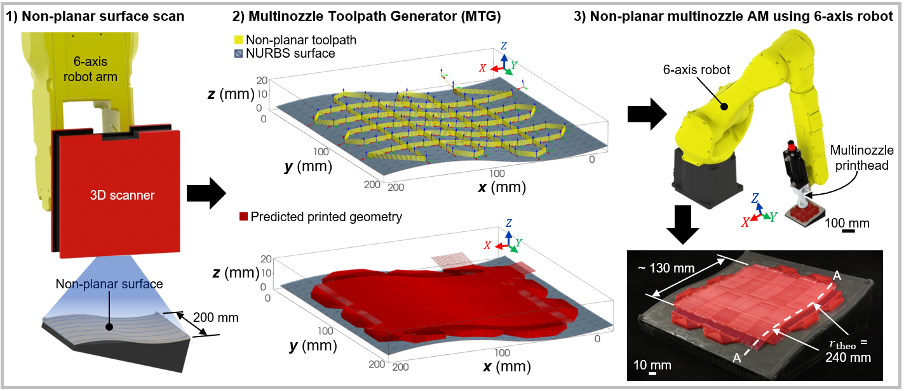

# Multinozzle Toolpath Generator (MTG)

Non-planar multinozzle toolpath generation for the fabrication of microscaffold networks using a 6-axis robot arm. 
This project was developed as an objective of a PhD within the FACMO industrial research Chair at Polytechnique Montreal in the Laboratory for Multi-scale Mechanics.

Contacts:
- Jean-François Chauvette (Author) : chauvettejf@gmail.com
- Daniel Therriault (supervisor and permanent corresponding author) : daniel.therriault@polymtl.ca

Please contact us if you would like to contribute to this project.

## Install python packages

This project has been tested on Python 3.7, Python 3.8 using Spyder 5.4.2. The packages and recommended versions are found in the requirements.txt . If those packages conflict with your installation, consider using this project in it's own environment. 

Install requirements:

$ python3 -m pip install -r requirements.txt

It is mandatory to install the geomdl module for the non-planar toolpath generation

# Context of the work

This work allows the generation of a non-planar additive manufacturing toolpath for a multinozzle printhead composed of a series of nozzles arranged in a 1D configuration (e.g., a row of 26 nozzles in the case of this project).
The toolpath can be sent to the robot simulation software RoboDK (https://robodk.com/download) to simulate a 6-axis robot trajectory, convert and upload the program on the robot controller.

The functionality of the code, the toolpath collision detection algorithm and all other work related to the MTG was tested on a Fanuc robot M-20iB/25. For any other 6-axis robot, USE AT YOUR OWN RISK.

The generated toolpath is used to manufacture networks of interconnected micron-scale filament stacking, refered as microscaffolds. Due to the nature of the multinozzle device used in this work, the fabrication if limited to periodic geometry.

## Publications

Paper 1 : High-speed multinozzle additive manufacturing and extrusion modeling of large-scale microscaffold networks
* https://www.sciencedirect.com/science/article/pii/S2214860421004541
* Explanation of the microscaffold networks geometry and potential of multinozzle printheads.

Paper 2 : Non-planar multinozzle additive manufacturing of thermoset composite microscaffold networks : 
* URL comming soon
* Explanation of the MTG concepts, development and demonstrations of potential with print examples

# How to use

## Substrate scanning & surface fitting

If you want to generate a planar toolpath, skip to the Toolpath generation step.

The scanner used for all non-planar substrate scan was a GOM Atos Core 200 3D scanner. 
1) Use the scanner to obtain an STL reconstruction of the substrate.
2) Using GOM inspect, perform a 3-2-1 alignment on the mesh so it matches the user (or workpiece) reference frame of your experiment). IMPORTANT NOTE : All odd-numbered layers (i.e., layer 1, 3, 5, ...) will be print in the Y direction of this reference frame and the even-numbered layers will be printed in the X direction.
3) Using Blender (https://www.blender.org/), import the STL file.
4) Create a grid mesh on top of the substrate.
5) Use the shrinkwrap modifier to project the grid on the substrate. You may apply the modifier and make any other modification to the mesh that your deem necessary. It is important that the mesh stays in a grid shape of n × m vertices.
6) Take note of the number of vertices of the grid in the X and Y directions.
7) Export the projected grid as an STL file. Place the stl file in : .\prefs\meshes\
8) In the MTG parameters window, under the "Other options" column, choose the STL file that you just created.
9) After setting all parameters, a "Surface interpolation parameters" window will appear.
10) Enter the number of vertices on X for Size u, number of vertices on Y for Size v, the NURBS interpolation degrees for u and v directions and the interpolation delta (you may leave the default value if you don't know).
11) Once your click OK, your vertices will be used as control points to create a NURBS representation of your substrate. You can choose the now exported .json file on step 8) to avoid interpolating the NURBS surface again.

## Toolpath generation

Create a new project or load a previous project.

1) Open up "multinozzle_toolpath_generator_vX.X.py" in Spyder and execute the script.
2) You may load a previous project by choosing to load a previously generated .json file or create a new one.

Once you click OK, you will see the main parameters window open, in which you can design the multinozzle toolpath. The window is divided by three columns: 1. Robot parameters, 2. Print geometry and 3. Other options. Please read the comments in the code to understand the purpose of each parameters.

Here are a few notes on some parameters :

Under the first column, you can choose the robot traveling, printing and layer change speed. You may change some of the behaviors in the code according to your experimental setup.
* The speeds will be saved in a Fanuc register in order to quickly change their value in the TPP file from the teach peandant.
* The multinozzle extrusion voltage is used to send an AO signal of 0-10 VDC to a custom pressure controller used for generating hydraulic pressure inside the multinozzle printhead.
* The multinozzle configuration represent the geometrical layout of the nozzle arrangement of the multinozzle printhead. You may add your own configuration in the code to choose from here in the future. You need to add your configuration as a dictionary (see examples in the code) inside the list MLTNZL_CONFIGS.
    MLTNZL_CONFIGS = [MLTNZL_CONFIG_MEK_SN123, your_config_here]
* Materials were developed within the scope of the FACMO Chair. You may add your own material as a dictionary (see examples in the code) inside the list MATERIALS
    MATERIALS = [MAT_INK6040, MAT_ABRA012C, MAT_EPON014, your_new_material_here]

Under the second column, some parameters can be modified to obtain a multilevel porosity microscaffold network.
1) First change the "Thicknesses" parameter to include the limiting thicknesses of each porosity level, separated by a comma. For example :
    Thicknesses (mm): 4.0,6.0
This will create 2 porosity level: the first porosity level will be printed from 0 to 4 mm thick and the second process will be printed from 4 to 6 mm.
2) Then, modify the "Nominal pore sizes parameter" to attribute different pore sizes to the levels. Use commas again :
    Nominal pore sizes (mm): "0.750, 0.184"
This will design the first level with a printed distance between filaments of 750 microns and the second level with a distance of 184 microns.
3) Then, change the following paramters accordingly, using commas :
* Layer change bleed 
* Printing bleed
* Wall distances
* Nominal pore sizes

Under the third column, you may :
* Choose to set the "Debug mode" to True to generate toolpaths without sending them to RoboDK. Set to False to connect to RoboDK Python API and export the toolpath into the RoboDK simulation environment.
* Choose to set the "Export expected geometry" to True to export a .vtp polydata object that can be opened with Paraview (https://www.paraview.org/). Paraview let's use visualize scientific data. You may use Paraview to export the geometry as a .x3d object than can be converted to an .STL using Blender.

## Robot simulation

You need to have RoboDK installed on your PC for this part to work. You can buy a RoboDK licence or try it for free at this URL : https://robodk.com/download

1) To send the generated toolpath to RoboDK, switch the "Debug mode" option to False under the third column ("Other options").
2) Once your click OK, the toolpath will be generated as usual, and will be sent to RoboDK at the same time. This step takes considerably longer than the debug mode. For reference, a toolpath generated under debug in 30 s may take ~ 8 min to generate in the RoboDK simulation environment. Follow the generation progression using the Spyder console.
